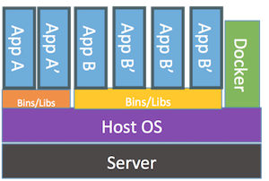
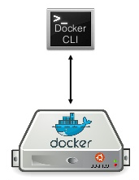
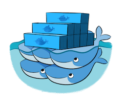
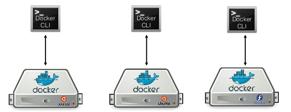
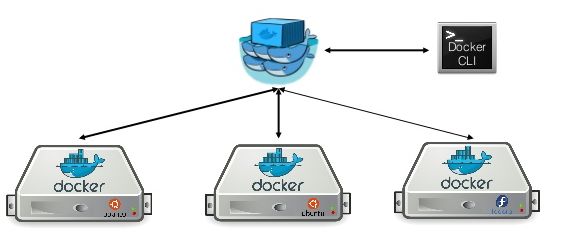

title: swarm
name: inverse
layout: true
class: center, middle, inverse
---
# Docker swarm
### Docker Grenoble meetup - 08 Juin 2015

---

## Online version (HTML) :

[http://dduportal.github.io/presentations/docker-meetup-grenoble-20150608](http://dduportal.github.io/presentations/docker-meetup-grenoble-20150608)

Proudly powered by [RemarkJS](https://github.com/gnab/remark)

???

## Offline version (PDF) :

[http://dduportal.github.io/presentations/mixit-2015-devbox-docker/docker-meetup-grenoble-20150608.pdf](http://dduportal.github.io/presentations/mixit-2015-devbox-docker/docker-meetup-grenoble-20150608.pdf)

Proudly exported with [Deck2PDF](https://github.com/melix/deck2pdf)

---
layout:false

# Agenda :

1. Whoami
2. Pourquoi Swarm ?
3. Concepts de Swarm
4. Demo

---
template: inverse

# Whoami

---

layout: false
.left-column[
# Whoami
]
.right-column[
# Damien DUPORTAL

.center[]

* DevOps Engineer @ Worldline

* Grimpeur
* Français émigré en Belgique
* Enseignant la HA et les SIGs (ENSG, EPSI)

* Contact :
  * Gmail : `damien.duportal@gmail.com`
  * Twitter : [@DamienDuportal](https://twitter.com/DamienDuportal)
  * Github : 
      * [dduportal](https://github.com/dduportal)
      * [mes Dockerfiles](https://github.com/dduportal-dockerfiles)

]

---
template: inverse

# Pourquoi Swarm ?

---

layout: false
.left-column[
# Whoami
# Pourquoi ?
]
.right-column[

# Docker "basique" 

* Un serveur Linux
* Un service "docker"
* Une commande "docker"

.center[]

]

---

layout: false
.left-column[
# Whoami
# Pourquoi ?
]
.right-column[

# Docker "remote" avec CLI 

* Un client docker local
* Un "Docker Engine" distant
* Communication par HTTP == Serveur web !

.center[]

]

---

layout: false
.left-column[
# Whoami
# Pourquoi ?
]
.right-column[

# Résilience ? 

Comment garantir la continuité de service :

* Maintenance programmée ?
* Docker engine qui plante ?

.center[]

]

---

layout: false
.left-column[
# Whoami
# Pourquoi ?
]
.right-column[

# Solution : Docker Swarm 

.center[]

* Utiliser plusieurs "Docker engine"
* En toute transparence
* Approche "Lean"

]

---
template: inverse

# Concepts de Swarm

---

layout: false
.left-column[
# Whoami
# Pourquoi ?
# Concepts
]
.right-column[

# Sans Swarm 

* 3 Docker engines
* 3 lignes de commande (ou 1 seule avec trois configurations)
* 3 provisionnings
* Plomberie inter-host

.center[]

]

---

layout: false
.left-column[
# Whoami
# Pourquoi ?
# Concepts
]
.right-column[

# Avec Swarm 

* 3 Docker engines
* Un "Swarm Manager" == un serveur HTTP qui gère les "engines"
* 1 CLI avec une API : transparent

.center[]

]
---

* Comment ?
  - Demarrer noeuds : quel discovery ?
  - Demarrer manager : config et MaJ ?

* Demo :
  * Phase 1 :
    - Schema MBA + PI
    - Demarrer PI, SSH, docker cli, docker run arm
    - Configuration Pi pour docker remote + registre + labels
    - Docker run remote depuis MBA pour rejouer
  * Phase 2 :
    - Manager en statique avec IP depuis b2d-MBA
    - Schema updated
    - Client depuis Mac OS qui lance des arm-nginx avec visu browser
  * Phase 3 :
    - Docker hub discovery pour disovery dynamique
    - schema upd
    - Agents, puis manager

